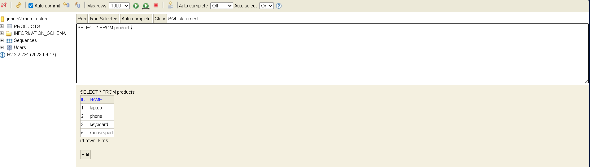
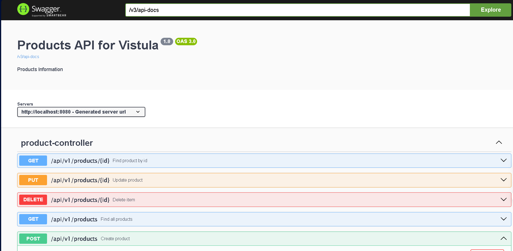
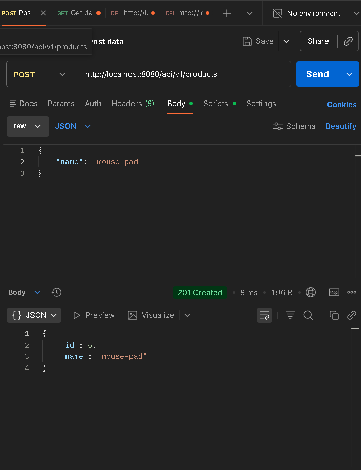
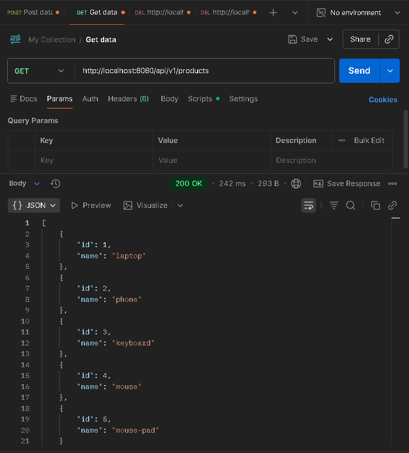
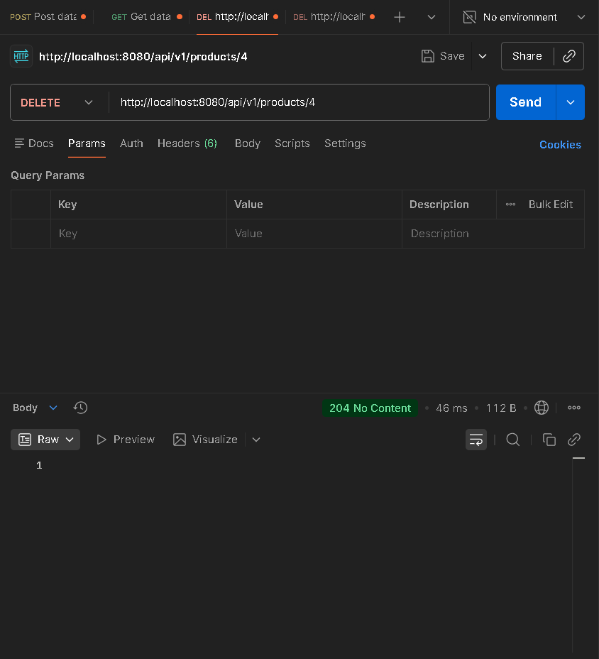
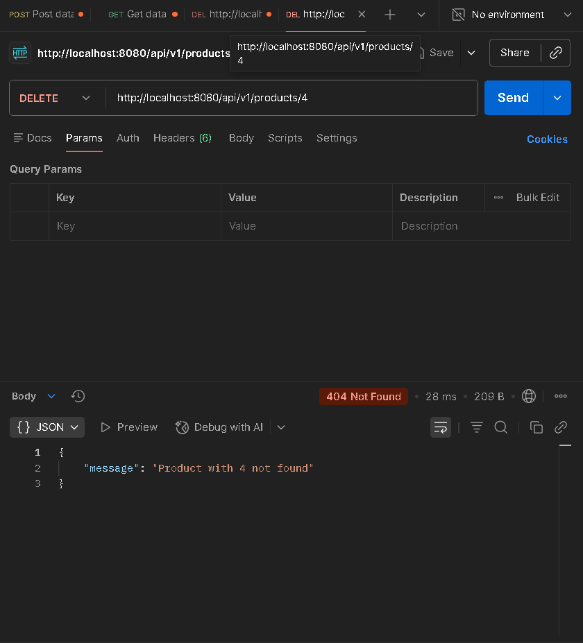

# Spring Boot REST-API

> **Vistula University**  
> A full working Spring Boot REST-APi application

---

## 🚀 Features

### ✅ CRUD Operations (Products API)

| Method | Endpoint | Description |
|------|--------|------------|
| POST | `/api/v1/products` | Create a new product |
| GET | `/api/v1/products` | Retrieve all products |
| GET | `/api/v1/products/{id}` | Retrieve product by ID |
| PUT | `/api/v1/products/{id}` | Update an existing product |
| DELETE | `/api/v1/products/{id}` | Delete a product |

---

## 🗄️ Database Integration

- **H2 in Memory Database**
- Automatic schema generation from entities
- Spring Data JPA repositories

### 📍 H2 Console Access

---

## 📄 SWAGGER:

Interactive API documentation powered by **Swagger / OpenAPI**.

---

## 🧩 **PostMan:**

## 📦 **Post method**

---

## 🧪 **Get method**

---

## 📄 **Delete method**

---

## ⭐ **Exception handling method**

---

### 🧑‍ Skills used in this project
- Java 17 features
- Dependency Injection
- database management
- JSON serialization / deserialization
- Spring boot
- Maven build automation

---

## ✨question 2.G

**the method are already built-in in JPAREPOSITORY so basically spring data jpa helps us with them without having to code them from scratch**
---